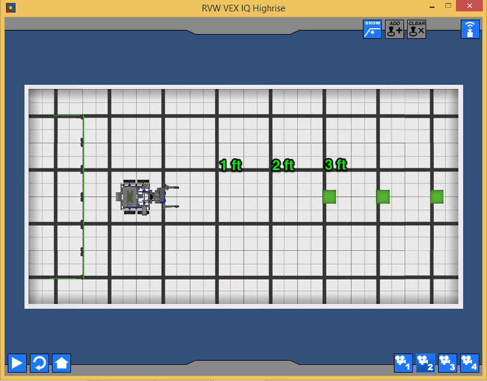
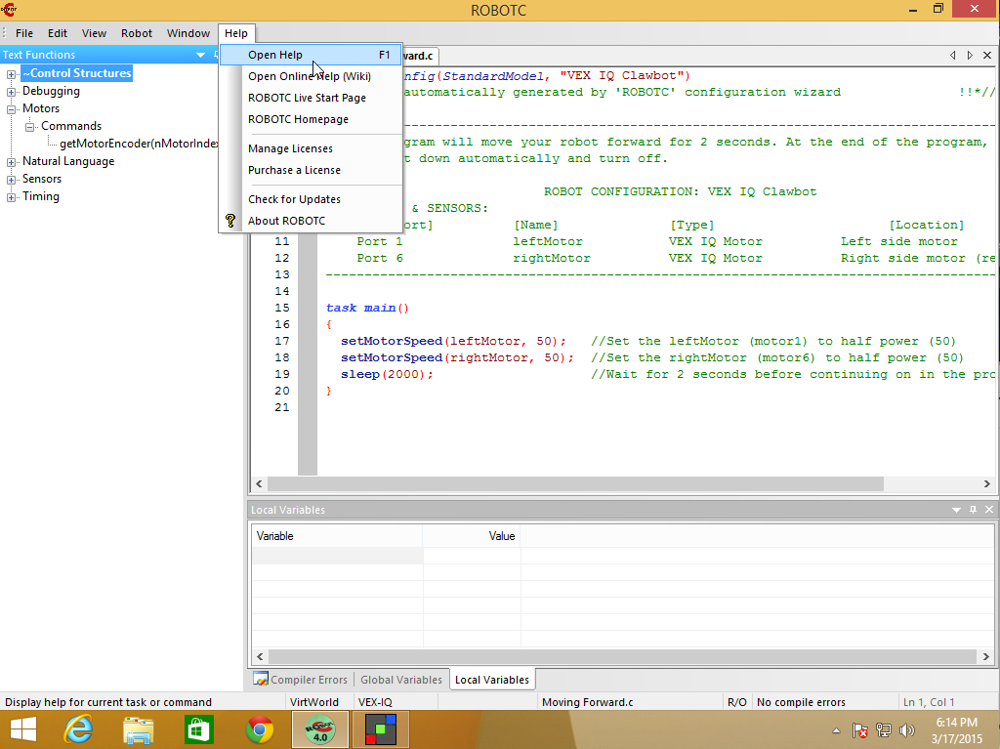
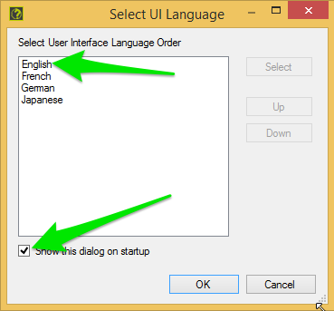
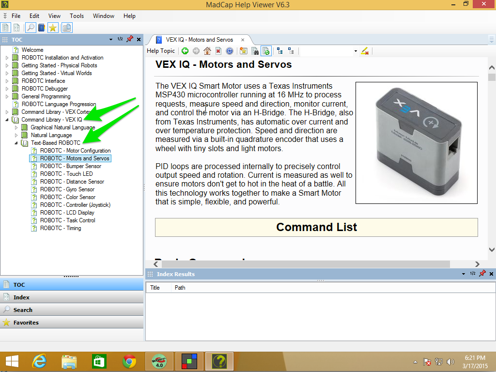

# Chapter 2 - Basic Movement 1

If you look at the Training Table selection screen in Robot Virtual Worlds you'll see that the description for **Basic Movement 1** is:

Program the robot to pick up each cube, and place them in the goal.


## Thinking

Programming isn't about jumping right in and typing.  You should spend some time thinking about what it is you need to do.  So let's think about what we need to do just to get the first green block to goal.

1. Move forward, some distance
2. Grab the cube
3. Raise the arm
4. Make a U-Turn
5. Move forward (back to goal), some distance
6. Open the claw to drop the cube

It helps to lay out your steps in short phrases that anyone should be able to understand.  Not only does it make it easier to discuss your **Idea** with your teammates but it also makes it easier for Judges to understand what you're trying to do.

_HINT: Working in small steps and checking each step as you go is **so much easier** than trying to do everything all at once._

So, let's get started, one small step at a time.

## Move Forward

The first thing we need to do is get our robot close to the cube, we even said "Move Forward", so that sounds like a good method to make.

_Note: There are lots of synonyms for **function**, including **method** and **subroutine**.  I'll mostly use **function** and **method**._

So let's start out with a stub to our method:

```c
void moveForward(float inches)
{
  // method body will go here
}
```

_A stub is just a skeleton or placeholder for what we'll write later._

One black square on the VEX IQ field is 12"x12", so conveniently we can count from the black square where our claw is to where the green cube is and figure out that we need to go 3 feet.  



3 feet is a fairly big number when we're talking about only an 8 foot table, so we'll convert to inches meaning: We need to move our robot forward 36 inches (`3 feet * 12 inches/feet = 36 inches`).

Figuring out how to make our robot move is something we've been doing for a while, it basically boils down to the following formula:

`distance travelled = number of rotations * wheel circumference`

We only have one equation, so we can only sole for one variable.  We know distance travelled, that's **36 inches**, we can figure out **wheel circumference**, so that leaves only number of rotations which we'll solve for.

Let's start with circumference, there are a few forumlas we can use:

* circumference = 2&pi;r
* circumference = &pi;d

The diameter is given to use in the Robot Virtual Worlds Home Screen where we did Robot Selection:


Our wheel diameter is **6.4 cm**.  Great, but we're working in inches, so we need to convert `cm` to `inches`.  That conversion looks like:

`6.4 cm * 1 in / 2.54 cm = 2.52 in`

So our wheel diameter in inches is **2.52 in**

Now we have all the pieces to figure out how many rotations we need to go, but we're going to let the computer solve that problem for us:

```c
void moveForward(float inches)
{
  float circumference = 2.52 * PI;
  float rotations = inches / circumference;
}
```

So at this point, if we called `moveForward(36)` in our `task main()` we should end up with `rotations = 4.55`.

Can we make this robot move yet or what????

Yes, let's figure out what function we can use.  We'll start with **Help**, you get to help in two ways:

* Pressing the function key **F1**
* Selecting **Help** menu and choosing **Open Help**



If this is the first time you're opening up **Help** you might see the following dialog:



You'll want to choose **English** and then uncheck the box **Show this dialog on startup** so you don't have to choose English again.

If you're not sure where to start, start with the **Table of Contents** (**TOC**) on the left hand side, you want to expand:

* Command Library - VEX IQ
* Text-Based ROBOTC

Since we're worrying about moving, we need to look at **Motors and Servos**.



You can scroll through the help on the right to look for interesting functions, here are two that I think look promising:

* `moveMotorTarget` This command tells the robot to move a relative distance, it will add or subtract distance from any previously specified targets.  It takes 3 parameters (the motor, the position in degrees, and the speed -100 to +100).
* `setMotorTarget`  This command tells the robot to move an absolute distance.  It takes 3 parameters (the motor, the position in degrees, and the speed -100 to +100).

We'll use `setMotorTarget`, but we need to change **rotations** into **degrees**.

```c
void moveForward(float inches)
{
  float circumference = 2.52 * PI;
  float rotations = inches / circumference;
  float degrees = rotations * 360;

  resetMotorEncoder(leftMotor);
  resetMotorEncoder(rightMotor);
  setMotorTarget(leftMotor, degrees, 75);
  setMotorTarget(rightMotor, degrees, 75);
  waitUntilMotorStop(leftMotor);
  waitUntilMotorStop(rightMotor);
}
```


