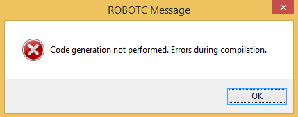
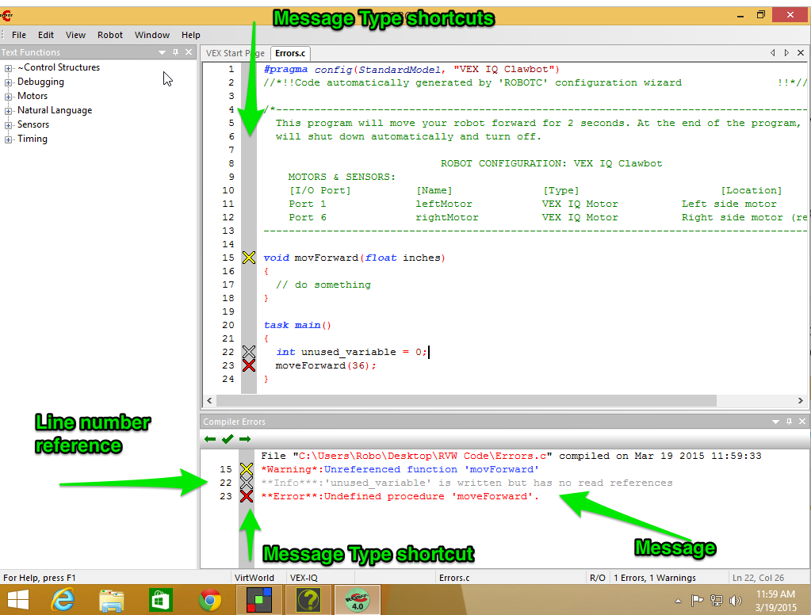

# Help, I Have Errors

In order to make you more self sufficient, and to save my sanity :), here are a list of things I expect you to check before you ask me or your teammates for help.

## How to Use this Page

Two ways to find what you're looking for (Starting from the first compiler message):

1. Press `CTRL+F` and type a word or two in that box to search (use the most unique word in the compiler message)
2. Scan through the headings (they're underlined) and see if you can match up a few of the words.

Once you've found it, then look at the details for that section and most importantly the **FIX** listed in each section.

## Compiler Errors

Compiler Errors will, unfortunately, be a fact of life as a programmer.  Here's the sign that you did something wrong:



Sometimes the messages you get back from the compiler aren't completely obvious, but the more familiar you get with them the easier it'll be to figure out what's wrong with your program.  First let's look at where you can find your compiler messages:



Compiler Messages show up in a window pane at the bottom of the ROBOTC IDE.  Looking at the above screenshot there's actually a lot of information there:

* What line number the compiler is talking about
* What type of message this is (Error, Warning, Info)
* The actually message

Let's quickly chat about the various Message Types:

* **Info** nice to know information that the compiler discovered. These messages are really just to help you keep your code clean, as far as the compiler can tell they don't have the potential to cause any problems. e.g. Maybe you defined a variable to use somewhere else, but deleted that other code, so that variable is hanging around for no reason.
* **Warning** the compiler is pretty sure this thing will cause a problem, just maybe not right now.  e.g. You write a **function** `moveForward(float inches)` but it's not being used.  The compiler is pretty sure you wanted to use it, but you're not.
* **Error** something is broken and you need to fix it.

In a perfect world you should strive to have **no messages** at all in the Compiler Errors window pane, your code will generally be cleaner.

## Unreferenced function / Undefined Procedure

From the following code:

```c
void movForward(float inches)
{
  // implementation
}

task main()
{
  moveForward(36);
}
```

You would get this pair of messages:

```
*Warning*:Unreferenced function 'movForward'
**Error**:Undefined procedure 'moveForward'
```

Means you have a **spelling error**.  It really doesn't matter if they're spelled correctly or not, all the compiler cares about is that they're spelled **the same**.

**FIX** Make sure the spelling is the same for whatever the compiler is complaining about.  In the above example, it's best to fix the function declaration and add an 'e':

```c
void moveForward(float inches)
```

## Undefined variable / has no read references

From the following code:

```c
task main()
{
  float inchs = 36;
  moveForward(inches);
}
```

You would get this pair of messages:

```
**Info***:'inchs' is written but has no read references
**Error**:Undefined variable 'inches'. 'short' assumed.
```

Means you have a **spelling error**.  It really doesn't matter if they're spelled correctly or not, all the compiler cares about is that they're spelled **the same**.

**FIX** Make sure the spelling is the same for whatever the compiler is complaining about.  In the above example, it's best to fix the variable declaration and add an 'e':

```c
  float inches = 36;
```

## No Body Declared / Defined

This one is pretty scary, but most of the time it's a simple fix.

The following code:

```c
void moveForward(float inches);
{
	float degrees = inches / 2.52 * 360;
	int power = 75;
	resetMotorEncoder(leftMotor);
	resetMotorEncoder(rightMotor);
	setMotorTarget(leftMotor, degrees, power);
	setMotorTarget(rightMotor, degrees, power);
	waitUntilMotorStop(leftMotor);
	waitUntilMotorStop(rightMotor);
}

task main()
{
	moveForward(36);
}
```

Produces the following errors:

```
**Error**:No body declared for referenced procedure 'moveForward'
**Error**:No body defined for procedure prototype 'moveForward'
**Error**:Undefined variable 'inches'. 'short' assumed.
**Error**:Duplicate definition for task 'main'.
```

Yes, that's a lot of messages, fortunately only a couple of them matter and the rest go away once you fix the main problem.  We'll start at the top and try to make sense of the messages:

`No body declared for referenced procedure 'moveForward'` is the compiler telling you that it knows you want to use a function `moveForward` but it can't find it.

`No body defined for procedure prototype 'moveForward'` is even more telling.  Prototype methods aren't something you'll get into for a long time, but essentially what they are is the method signature without the body, it looks like:

```c
void moveForward(float inches);
```

There isn't a method body here because the line ends with a `;`.  Normally we'd put `{` and `}` after the method to fill in the body.  It even looks like we did in the code sample, but that one `;` ruined everything for us.

**FIX** Check the method referenced in the compiler messages and make sure:

* There is no semi-colon `;` on the line where you define the method
* Make sure the body of the method is enclosed in `{` and `}`

## Unexpected '}' During Parsing

Here's another one that gives way more error messages than you think it should.

The following code:

```c
void moveForward(float inches)
}
	float degrees = inches / 2.52 * 360;
	int power = 75;
	resetMotorEncoder(leftMotor);
	resetMotorEncoder(rightMotor);
	setMotorTarget(leftMotor, degrees, power);
	setMotorTarget(rightMotor, degrees, power);
	waitUntilMotorStop(leftMotor);
	waitUntilMotorStop(rightMotor);
}

task main()
{
	moveForward(36);
}
```

Results in the following compiler complaints:

```
**Error**:No body declared for procedure
**Error**:Type mismatch with previous 'const' declaration for variable with same name
**Error**:Undefined variable 'inches'. 'short' assumed.
**Error**:Variable 'degrees' has been previously defined with a different value.
**Error**:Executable statements not valid in 'main' declaration block
**Error**:Executable statements not valid in 'main' declaration block
**Error**:Executable statements not valid in 'main' declaration block
**Error**:Executable statements not valid in 'main' declaration block
**Error**:Executable statements not valid in 'main' declaration block
**Error**:Executable statements not valid in 'main' declaration block
**Error**:Unexpected '}' during parsing
```

There is a lot of noise in these messages because what you thought was the function body isn't.  There are a few things to focus on here:

```
**Error**:No body declared for procedure
```

and

```
**Error**:Unexpected '}' during parsing
```

The first hint, `No body declared for procedure` is a clear sign that we've done something wrong in some method (or we actually forgot to write it).  The second hint `Unexpected '}' during parsing` means that we probably have some braces the wrong way.

The second hint is actually more important here, it's saying that it found a close brace `}` without a corresponding open brace `{`.

**FIX** Look through your source code and make sure every function starts with an open brace `{` and ends with a close brace `}`.

Another helpful hint is to check your code formatting.  From the **Edit** menu, select **Code Formatting** and **Format Whole File**.


If everything is correct with your file, not missing semi-colons `;`, all the braces are the correct way and paired, you should be left with a nicely indented file.  However, if you get something that looks like this:

```c
void moveForward(float inches)
}
float degrees = inches / 2.52 * 360;
int power = 75;
resetMotorEncoder(leftMotor);
resetMotorEncoder(rightMotor);
setMotorTarget(leftMotor, degrees, power);
setMotorTarget(rightMotor, degrees, power);
waitUntilMotorStop(leftMotor);
waitUntilMotorStop(rightMotor);
}
```

You can tell something is wrong at `float degrees` because that should be indented (moved into the right) as the method body.  That's a good hint to look above the first line where you see the formatting go wrong.

## Unmatched Left Brace

The following code:

```c
void moveForward(float inches)
{
	float degrees = inches / 2.52 * 360;
	int power = 75;
	resetMotorEncoder(leftMotor);
	resetMotorEncoder(rightMotor);
	setMotorTarget(leftMotor, degrees, power);
	setMotorTarget(rightMotor, degrees, power);
	waitUntilMotorStop(leftMotor);
	waitUntilMotorStop(rightMotor);


task main()
{
	moveForward(36);
}
```

Results in the following compiler messages:

```
**Error**:Ummatched left brace '{'
**Error**:Task 'main' is not defined at global scope level
**Error**:Tasks must be defined at main scope level
**Error**:Expected->'}'. Found 'EOF'
```

Unmatched (the spelling in the compiler message is incorrect) left brace '`{`' means we're missing a right (or closing) brace `}`.

**FIX** Figure out where you forgot to put a closing brace `}` and put one there :)

Another helpful hint is to check your code formatting.  From the **Edit** menu, select **Code Formatting** and **Format Whole File**.


If everything is correct with your file, not missing semi-colons `;`, all the braces are the correct way and paired, you should be left with a nicely indented file.  However, if you get something that looks like this:

```c
void moveForward(float inches)
{
	float degrees = inches / 2.52 * 360;
	int power = 75;
	resetMotorEncoder(leftMotor);
	resetMotorEncoder(rightMotor);
	setMotorTarget(leftMotor, degrees, power);
	setMotorTarget(rightMotor, degrees, power);
	waitUntilMotorStop(leftMotor);
	waitUntilMotorStop(rightMotor);


	task main()
	{
		moveForward(36);
	}
```

You can see in the above code listing that `task main()` and its body are indented (pushed to the right).  It should be as far left as possible.  Again, if you start above the first line of code that looks wrongly indented you should be able to track down your error.

